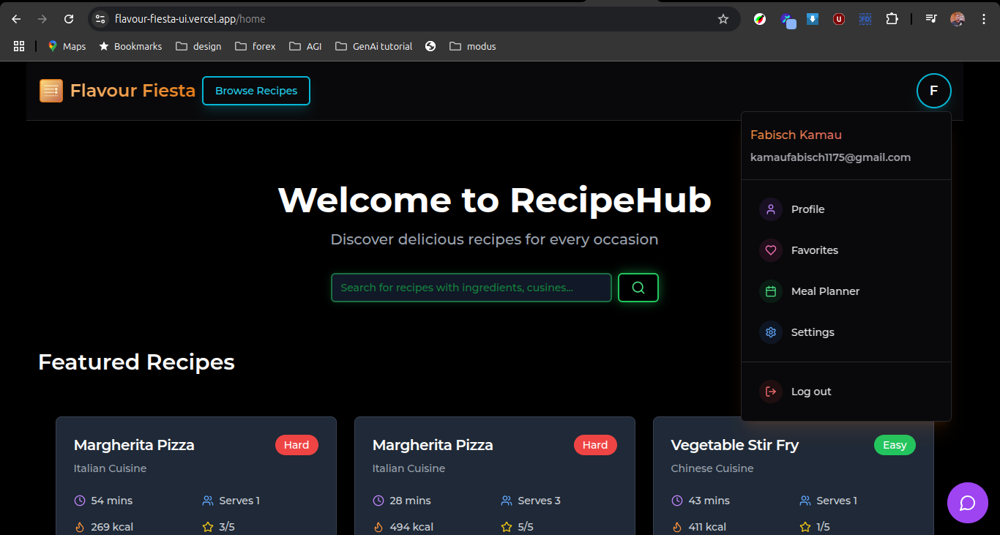

# Vite Web App: Recipe and Meal Planning Manager

## Introduction

Welcome to the Recipe and Meal Planning Manager! This web application is designed to help you efficiently manage recipes, create personalized meal plans, and cater to your unique preferences. Built using the Modus Framework and powered by a Neo4j database, this project showcases a seamless integration of knowledge graphs and advanced technologies like LLMs (Large Language Models).

Developed for the Hypermode Hackathon, the project demonstrates innovative use cases for recipe discovery, personalized recommendations, shopping list generation, and meal planning.

## Features

- **Recipe Discovery:** Explore a wide variety of recipes tailored to your preferences.
- **Personalized Recommendations:** Get recommendations based on your meal history and preferences.
- **Shopping List Generation:** Automatically create shopping lists for your selected recipes or meal plans.
- **Meal Planning:** Plan your meals ahead of time with a user-friendly interface.
- **Neo4j Integration:** Leverage the power of knowledge graphs for advanced data management and insights.
- **LLM Integration:** Enhance user experience with natural language processing capabilities for recipe queries and recommendations.

## Project Images

\_

## Installation

Follow these steps to set up the Vite web app:

### Prerequisites

Ensure you have the following installed on your system:

- Node.js (>= 22.x)
- npm or yarn
- Neo4j Database (Community or Enterprise Edition)

### Steps

1. **Clone the Repository**

   ```bash
   git clone https://github.com/fabischkamau/flavour-fiesta-ui.git
   cd flavour-fiesta-ui
   ```

2. **Install Dependencies**

   ```bash
   npm install
   # or
   yarn install
   ```

3. **Set Environment Variables**
   Create a `.env` file in the root directory and configure the following variables:

   ```env
   VITE_SUPABASE_ANON_KEY=<your-superbase-public-anon-key>
   VITE_SUPABASE_URL=<your-superbase-url>
   VITE_MODUS_API_ENDPOINT=<your-backend-api-endpoint>
   VITE_MODUS_API_TOKEN=<your-hosted-api-token>
   ```

4. **Run the Development Server**

   ```bash
   npm run dev
   # or
   yarn dev
   ```

   The app will be accessible at `http://localhost:5176`.

5. **Build for Production**
   To create an optimized build, run:

   ```bash
   npm run build
   # or
   yarn build
   ```

6. **Preview the Production Build**
   ```bash
   npm run preview
   # or
   yarn preview
   ```

## Contributions

Contributions are welcome! Feel free to fork the repository and submit a pull request with your enhancements.

## License

This project is licensed under the MIT License.

---

For any questions or feedback, please contact the project maintainer.
